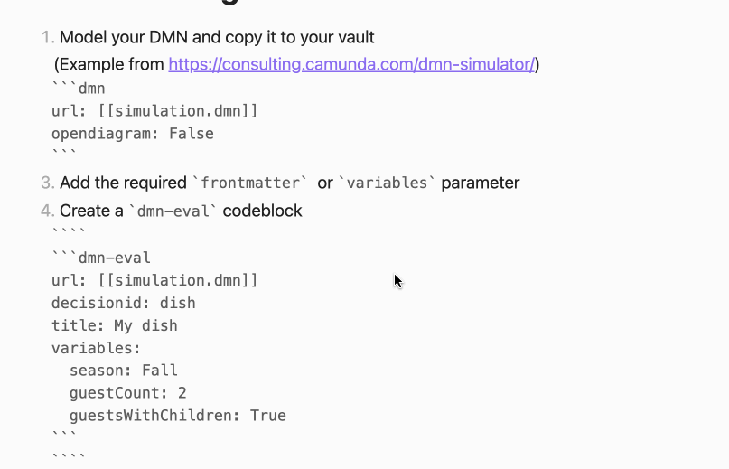

# DMN-Eval-Plugin for Obsidian [](https://github.com/joleaf/obsidian-dmn-eval-plugin/releases) [](https://github.com/joleaf/obsidian-dmn-eval-plugin/actions/workflows/release.yml) 

This plugin lets you evaluate (execute) DMNs within your [Obsidian](https://www.obsidian.md) notes.
The DMN evaluator is based on the [dmn-engine](https://github.com/camunda/camunda-bpm-platform/tree/master/engine-dmn)
library by [Camunda](https://camunda.com/).

## Install ..

### .. automatically in Obsidian (not yet)

1. Go to **Community Plugins** in your Obsidian Settings and **disable** Safe Mode
2. Click on **Browse** and search for "DMN Eval Plugin"
3. Click install
4. Toggle the plugin on in the **Community Plugins** tab

### .. manually from this repo

1. Download the latest [release](https://github.com/joleaf/obsidian-dmn-eval-plugin/releases) `*.zip` file.
2. Unpack the zip in the `.obsidan/plugins` folder of your obsidian vault

## Requirements

- [Java](https://www.java.com/en/download/help/download_options_de.html) 14 or later

## How to use

1. Add a valid `*.dmn` file to your vault (e.g., `my-diagram.dmn`) (e.g., modeled with
   the [Camunda Modeler](https://camunda.com/de/download/modeler/))
2. Add the DMN to your note:

````
```dmn-eval
url: [[my-diagram.dmn]]
decisionId: Evaluator
```
````

3. All front matter data of your note are used as input for the DMN evaluation
4. If no errors occur, the output of the decision will be evaluated and printed to your note.

### Parameter

You can customize the view with the following parameters:

| Parameter       | Description                                              | Values                                                   |
|-----------------|----------------------------------------------------------|----------------------------------------------------------|
| url             | The url of the *.dmn file (required).                    | Relative/Absolute path, or `[[*.dmn]]` as markdown link. |
| decisionId      | An ID of a decision table to evaluate (required).        | String value                                             |
| title           | An optional title rendered before the DMN output.        | String value                                             |
| noResultMessage | An optional message if the evaluation returns no result. | String value (Default: "No result")                      |

### Example



## How to dev

1. Clone this repo into the plugin folder of a (non-productive) vault (`.obsidian/plugins/`)
2. Build DmnEvaluator:
    1. `cd DmnEvaluator && mvn --batch-mode --update-snapshots package && cd ..`
    2. `cp DmnEvaluator/target/DmnEvaluator*-jar-with-dependencies.jar DmnEvaluator.jar`
3. `npm i`
4. `npm run dev`
5. Toggle the plugin on in the **Community Plugins** tab

## Donate

<a href='https://ko-fi.com/joleaf' target='_blank'>
